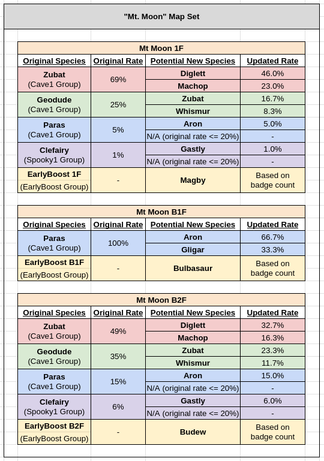

# Pokémon Challenge

https://github.com/slim-al/poke-challenge is a fork of https://github.com/pret/pokefirered that is meant to be played by multiple players in a timed challenge. The game doesn't support link battles -- players can battle using [Pokémon Showdown](https://pokemonshowdown.com/).

Major changes:
 - **Deterministic game seed:** Wild Pokémon, trainer Pokémon, and overworld items are randomized based on the Rival name specified at the beginning of the game. All non-key overworld items contain TMs. Some items may be randomly placed on water or in unreachable areas.
 - **Time limit:** After 5 hours pass, the player is locked in the Celadon Department Store. The game clock doesn't decrease while the START and Mart menus is active, including when the player is using the Pokédex, Pokémon summary screen, bag, etc. outside of battle.
 - **Level band:** Pokémon stop gaining experience if they become too overleveled compared to the rest of the team. Rare candies also stop working.
 - **Level scaling:** Wild and trainer Pokémon levels increase based on the player's party Pokémon levels and badge count.
 - **Gen 4 Pokemon, Moves, TMs, Abilities, & Items:** Most Gen 4 Pokémon in Gen 1-3 families (e.g. Munchlax, Weavile) are added, with Gen IV HG/SS learnsets and abilities. The Department Store sells Gen 4 battle items, Nature Mints, and Ability Patches. Many Gen IV moves and abilities aren't implemented properly, and instead have placeholder effects. The full Pokémon list at the bottom of this page.
 - **New TMs and learnsets:** 64 TMs are added to the game, bringing the total to 156. Fully evolved Pokémon learn non-TM pre-evolution and egg moves at level 1. TMs can teach moves that were previously only learnable via breeding or move tutors. I.e. if a move is on Smogon it can be learned in this game. A free Move Relearner are added to the Department Store.

Helpful code links:
 - TM list: https://github.com/slim-al/poke-challenge/blob/master/all_tms.txt
 - Pokémon level-up learnsets (including level 1): https://github.com/slim-al/poke-challenge/blob/master/src/data/pokemon/level_up_learnsets.h
 - Pokémon TM01-TM50 and HM learnsets: https://github.com/slim-al/poke-challenge/blob/master/src/data/pokemon/tmhm_learnsets.h
 - Pokémon TM51-TM92 learnsets: https://github.com/slim-al/poke-challenge/blob/master/src/data/pokemon/gen4_tmhm_learnsets.h
 - Pokémon TM93-TM156 learnsets: https://github.com/slim-al/poke-challenge/blob/master/src/data/pokemon/new_tmhm_learnsets.h
 - Pokémon evolution conditions: https://github.com/slim-al/poke-challenge/blob/master/src/data/pokemon/evolution.h
 - Celadon City 5th floor items: https://github.com/slim-al/poke-challenge/blob/master/data/maps/CeladonCity_DepartmentStore_5F/scripts.inc
 - Item prices (CTRL+F for "price"): https://github.com/slim-al/poke-challenge/blob/master/src/data/items.json

Other changes:
 - Faster movement, animations, and text. Hold B to use normal walking speed.
 - Start the game with balls, healing items, the Old Rod, 6 Exp Shares, and more.
 - L button maps to A button. In battles, L button auto-fires A and holding R automatically runs away.
 - Holding SELECT plays audio notifications when the clock is running. This can be used to double check in which menus the clock is stopped. It plays alternating pitches every half second, and the save sound every time the clock advances one minute.
 - Gain experience for catching Pokémon.
 - Oak's aides give large sums of money for completing the Pokédex. You can find them in the Department Store and their original locations. The rewards are as follows:
   - 500 for 1 unique species.
   - 5k for 20 unique species.
   - 10k for 40 unique species.
   - 20k for 60 unique species.
   - 40k for 80 unique species.
   - 80k for 100 unique species.
 - Starter Pokémon are randomized based on the game seed. There is still one grass, water, and fire starter, and they will be chosen from the gen 1-3 starters.
 - Move tutors give the player a random TM instead. Purchasable, winnable, and gift TMs are randomized.
 - Overworld Pokémon (e.g. Snorlax, Articuno) can't be caught.
 - Gym leaders give the player a Rare Candy in addition to a TM upon earning a badge.
 - The Pokédex shows you the possible routes where each Pokémon can possibly be, for any game seed.
 - Once a legendary bird is defeated, pressing R in the Pokédex map screen will reveal a portion of the routes that seen Pokémon can be found in, _for the current game seed_:
   - ~33% of routes after beating 1 bird.
   - ~67% of routes after beating 2 birds.
   - 100% of routes after beating 3 birds.
 - Legendary birds also give the player a Rare Candy upon defeat.
 - Elite Four members give the player a Rare Candy and Nature Mint upon defeat (first time only).
 - The Champion gives the player a Rare Candy, Nature Mint, and Ability Patch upon defeat (every time).
 - The Karate Master gives the player a MACHO BRACE.
 - Physical/special split.
 - Dragonair, Pupitar, and Shelgon evolve at level 50.
 - Gift Pokémon are replaced with Spinda.
 - Items aren't sellable.
 - HMs are deletable without the Move Deleter.
 - Flash is no longer required in Rock Tunnel.
 - Old Amber is removed from the game.
 - Trade and happiness evolutions have been replaced with a new "Trade+ Stone", or Sun Stone & Moon Stone in cases where one Pokémon can evolve into multiple others (e.g. Eevee into Espeon or Umbreon). See full list [here](https://github.com/slim-al/poke-challenge/blob/master/src/data/pokemon/evolution.h).
 - Tyrogue can evolve using Sun Stone (Hitmonchan), Moon Stone (Hitmonlee), and Trade+ Stone (Hitmontop) in addition to his normal level 20 evolution. You can avoid evolving by pressing B if you want to wait to use a stone.
 - Pokémon that evolve by knowing a move (e.g. Ancient Power) instead evovle at the first level that they can know the move.
 - Player finds the Good Rod where the Old Rod used to be, and Super Rod where Good Rod used to be. The Super Rod can also still be found at its original location.
 - The PC is accessible from the START menu. Pokémon no longer heal when sent to the PC.
 - Start with a coin case containing 100 coins. Can no longer buy coins at the Game Corner. Earn 50 pity coins when you run out of coins at the slot machines.
 - The following prizes can be won at the Game Corner:
    - 100 Coins each: TMs for weather moves and Trick Room.
    - 150 Coins each: 6 random TMs, chosen based on the game seed.
    - 150 Coins: Level 1 Pikachu that knows Surf and Fly.
    - 150 Coins: Replacement Smeargle.
      - On Pokémon Showdown you can replace this with a Smeargle that knows any move that you have a TM for (exhausting the TM), and the EVs & IVs of any Pokémon that's not a part of your final team.
    - 150 Coins: Level 50 Ditto (can only be bought once -- subsequent ones are at level 2).
    - 300 Coins: Level 20 Lapras.
    - 500 Coins: Level 20 Eevee.
 - The trainer tower is accessible via the roof of the Department Store. Players can participate once time runs out. Trainer tower difficulty is increased.
 - Players can see their party's hidden power type and power in the "POKéMON INFO" summary screen.
 - Players can see their party's EVs and IVs by holding L and R respectively in the "POKéMON SKILLS" summary screen.
 - Repel works on all wild Pokémon, regardless of level.
 - Player gets 10x the number of steps in the Safari Zone.
 - Shiny Pokémon odds are increased 10x.
 - Party menu shortcut for giving/taking Exp Shares.
 - Safari Balls are 53% more effective, which makes them 15% more effective than Ultra Balls.
 - Pewter, Cerulean, and Vermillion Marts sell Revives.
 - Celadon Mart sells Ultra Balls.
 - All Pokémon that aren't normally catchable in the Safari Zone have a Safari Zone [flee rate](https://bulbapedia.bulbagarden.net/wiki/Kanto_Safari_Zone) of 75 (base 25% chance of fleeing).
 - After the Elite Four is beaten, the Sevii Islands Lorelei quest will be unlocked. The Elite Four can't be refought again until the quest is completed (and they will have higher level Pokémon).
 - Some early events are skipped; e.g. the Old Man.
 - Some moves have been updated to reflect their Gen IV properties (e.g. Dig's power increase).
 - Slightly modified wild encounters:
   - Dragonair -> Seadra
   - Wobbuffet -> Dragonair
   - Unown -> Zubat
   - Smeargle -> Zubat
 - Surge's gym "puzzle" is simplified. Player always find the second switch on their first try.
 - Fishing rod hit rate is increased from 50% to 75%.
 - Soft reser has been disabled.
 - Misc. bugfixes included in the https://github.com/pret/pokefirered `firered_rev1_modern` build.

## Level band / level cap

**TL;DR: Your Pokémon will stop gaining experience if they become too high a level compared to the rest of your team. The game will warn you when this is close to happening. The number of Pokémon considered depends on the number of badges you have.**

A 7 level band is in place. A portion of the player's team must be within 7 levels, inclusive, of each other;
e.g. a range of 30-37 is valid but 30-38 isn’t. The number of Pokémon that must be within the band is equal
to the number of badges the player has plus 1, _with a maximum cutoff of 5_. For example, the player has 3 badges,
they must have 4 Pokémon within 7 levels (inclusive) of each other. The fact that the 6th Pokémon isn't taken into
account means that 1 low level Pokémon can be safely carried around for HM use, Pickup, etc.

Rare candies do not work on Pokémon that are at the level cap.

If a Pokémon reaches the top of the band (also called the _level cap_), it will not be able to progress to the next
level, and won't be able to gain EXP once its EXP bar is filled. Other party Pokémon holding an EXP share will still
gain EXP, but any missed EXP that the Pokémon at the cap would have gained won’t be distributed to the other party
Pokémon. Note that, as in base FireRed, Pokémon that don't gain EXP also don't gain EVs.

The game will issue warnings when a Pokémon is near the current level cap, or the cap at the next badge. The latter
warning can be disabled in the OPTION menu, but this is not advised.

## Level scaling

### Wild encounters

**TL;DR: Wild Pokémon levels approach your party's average level as you gain badges. Your 1st and 6th highest level Pokémon are excluded from the calculation. Your party size must increase as you earn badges to take advantage of this.**

Wild Pokémon levels are scaled based on party Pokémon levels and the level that the wild Pokémon is supposed to be at. This is done by:
- Summing the levels of your 2nd through 5th highest Pokémon, for as many badges as you have.
  - I.e., your 1st and 6th higest Pokémon are ignored and the others are cycled through from higeest to lowest.
- Adding the level the wild Pokémon is supposed to be at.
- Dividing by the number of badges you have plus 1.

If you have fewer Pokémon in your party than the number of Pokémon required by the formula, empty party slots will be treated as level 2 Pokémon.

#### Example: less than 4 badges

Input:
 - **Number of badges:** 2
 - **Party Pokémon levels:** 20, 17, 16
 - **Level the wild Pokémon is supposed to be at:** 10

Output:
 - **Scaled level:** ⌊(`weighted_team_sum` + `original_wild_level`) / (`badge_count` + 1)⌋ = ⌊((17 + 16) + 10) / 3⌋ = ⌊43 / 3⌋ = 14

#### Example: more than 4 badges

Input:
 - **Number of badges:** 5
 - **Party Pokémon levels:** 28, 24, 22, 21, 20, 12
 - **Level the wild Pokémon is supposed to be at:** 14

Output:
 - **Scaled level:** (`weighted_team_sum` + `original_wild_level`) / (`badge_count` + 1)⌋ = ⌊((24 + 22 + 21 + 20 + 24) + 14) / 6⌋ = ⌊125 / 6⌋ = 20

#### Example: not enough Pokémon in party

Input:
 - **Number of badges:** 2
 - **Party Pokémon levels:** 20, 8
 - **Level the wild Pokémon is supposed to be at:** 6

Output:
 - **Scaled level:** ⌊(`weighted_team_sum` + `original_wild_level`) / (`badge_count` + 1)⌋ = ⌊((8 + **2**) + 6) / 3⌋ = ⌊16 / 3⌋ = 5

#### Exception for high level Pokémon

To disincentivize players from rushing to later routes to catch all of their Pokémon, wild Pokémon that
are supposed to be at level greater than or equal to the player's highest Pokémon will have their level
multiplied by 0.67 before it is plugged into the scaling formula.

### Trainer battles

**TL;DR: Trainer Pokémon levels increase by 0.5 on average for each badge you have.**

Trainer Pokémon levels are increased based on the number of badges the player has. For each odd numbered badge,
odd numbered trainer Pokémon levels are increased by 1. For each even numbered badge, even numbered trainer
Pokémon levels are increased by 1.

#### Example

| Player badge count  | Trainer party levels     |
| ------------------- | ------------------------ |
| 0 (vanilla FireRed) |   10,   10,   11,   11   |
| 1                   |   10, **11**, 11, **12** |
| 2                   | **11**, 11, **12**, 12   |
| 3                   |   11, **12**, 12, **13** |
| 4                   | **12**, 12, **13**, 13   |
| 5                   |   12, **13**, 13, **14** |
| 6                   | **13**, 13, **14**, 14   |
| 7                   |   13, **14**, 14, **15** |
| 8                   | **14**, 14, **15**, 15   |

## Pokémon randomization

Each Pokémon belongs to a group. Based on the Rival name specified at the
beginning of the game, Pokémon encountered in the normal FireRed game are
replaced with Pokémon from their group, as described below.

### Wild encounters

For every "map set" (e.g. Route 1, Mt. Moon) in the game:
  - All fishing Pokémon are deterministically replaced with 1 species from their
  group, regardless of encounter rate.
  - Non-fishing Pokémon with an encounter rate less than or equal to 20% are
  deterministically replaced with 1 species from their group.
  - Non-fishing Pokémon with an encounter rate greater than 20% are deterministically
  replaced with 2 _distinct_ species from their group. There is a ~66% and ~33% chance of
  encountering the 2 replacements, respectively. The Pokémon that comes first the group will
  be the more likely encounter, and one that comes later will be the less likely one.

Pokémon that are catchable via multiple methods (e.g. fishing and walking) in the same route
are replaced with the same Pokémon for each method.

#### Map sets

A "map set" is a collection of game locations that use the same Pokémon
replacement mappings. Note that this is a term specific to this ROM-hack, and is
different than the "map group" concept in the FR/LG source code.

The list of map sets is below. Any map that isn't in this list is in its own map set:

##### Dungeons:
- Mt. Moon 1F, B1F, B2F
- Rock Tunnel 1F, B1F
- Diglett's Cave North Entrace, South Entrance, B1F
- Pokémon Tower 3F, 4F, 5F
- Pokémon Tower 6F, 7F
- Pokémon Mansion 1F, B1F
- Pokémon Mansion 2F, 3F
- Seafoam Islands 1F, B1F, B2F
- Seafoam Islands B3F, B4F
- Victory Road 1F, 2F, 3F
- Mt. Ember Summit Path 1F, 2F, 3F

##### Water routes:
- Pallet Town, Route 20, Cinnabar Island
- Vermilion City, Route 11
- Route 12, Route 13
- Route 19, Route 20

#### Early boost

Additionally, each non-water game map (not map set) is deterministically assigned a
single Pokémon from the `EarlyBoost` group. The chance of finding one of these
Pokémon starts at 4%, and decreases by 0.5% for each badge you have.

#### Example

In Mt. Moon, each species is replaced with 1 or 2 species from their group, depending
on the catch rate. We see that Paras' second replacement is only encounterable on
floor B1F, because that's the only floor where Paras has a catch rate >20% in the
original game. The EarlyBoost Pokémon will have a rate of 0-4%, depending on the number
of badges the player has (other rates will be adjusted acordingly).

### Trainer battles

Trainer Pokémon are deterministically replaced with a single Pokémon from their group.

### Group list

Pokémon that come first in these group are more likely to be the more common substitution
in situations where a Pokémon maps to 2 species (i.e. for non-fishing Pokémon with a >20%
encounter rate).

| EarlyBoost |
| --- |
|[BUDEW](https://www.serebii.net/pokedex-dp/406.shtml)[PICHU](https://www.serebii.net/pokedex-dp/172.shtml)[IGGLYBUFF](https://www.serebii.net/pokedex-dp/174.shtml)[AZURILL](https://www.serebii.net/pokedex-dp/298.shtml)[MIME_JR](https://www.serebii.net/pokedex-dp/439.shtml)[SMOOCHUM](https://www.serebii.net/pokedex-dp/238.shtml)[ELEKID](https://www.serebii.net/pokedex-dp/239.shtml)[MAGBY](https://www.serebii.net/pokedex-dp/240.shtml)[CLEFFA](https://www.serebii.net/pokedex-dp/173.shtml)[BULBASAUR](https://www.serebii.net/pokedex-dp/001.shtml)[CHIKORITA](https://www.serebii.net/pokedex-dp/152.shtml)[TREECKO](https://www.serebii.net/pokedex-dp/252.shtml)[CHARMANDER](https://www.serebii.net/pokedex-dp/004.shtml)[CYNDAQUIL](https://www.serebii.net/pokedex-dp/155.shtml)[TORCHIC](https://www.serebii.net/pokedex-dp/255.shtml)[SQUIRTLE](https://www.serebii.net/pokedex-dp/007.shtml)[TOTODILE](https://www.serebii.net/pokedex-dp/158.shtml)[MUDKIP](https://www.serebii.net/pokedex-dp/258.shtml)|

| NormalFlying1 |
| --- |
|[ZIGZAGOON](https://www.serebii.net/pokedex-dp/263.shtml)[PIDGEY](https://www.serebii.net/pokedex-dp/016.shtml)[SENTRET](https://www.serebii.net/pokedex-dp/161.shtml)[RATTATA](https://www.serebii.net/pokedex-dp/019.shtml)[HOOTHOOT](https://www.serebii.net/pokedex-dp/163.shtml)[SPEAROW](https://www.serebii.net/pokedex-dp/021.shtml)[TAILLOW](https://www.serebii.net/pokedex-dp/276.shtml)[NATU](https://www.serebii.net/pokedex-dp/177.shtml)[HOPPIP](https://www.serebii.net/pokedex-dp/187.shtml)[AIPOM](https://www.serebii.net/pokedex-dp/190.shtml)[FARFETCHD](https://www.serebii.net/pokedex-dp/083.shtml)[SPINDA](https://www.serebii.net/pokedex-dp/327.shtml)[SNUBBULL](https://www.serebii.net/pokedex-dp/209.shtml)[SWABLU](https://www.serebii.net/pokedex-dp/333.shtml)[TEDDIURSA](https://www.serebii.net/pokedex-dp/216.shtml)[DELIBIRD](https://www.serebii.net/pokedex-dp/225.shtml)[STANTLER](https://www.serebii.net/pokedex-dp/234.shtml)|

| NormalFlying2 |
| --- |
|[LINOONE](https://www.serebii.net/pokedex-dp/264.shtml)[PIDGEOTTO](https://www.serebii.net/pokedex-dp/017.shtml)[FURRET](https://www.serebii.net/pokedex-dp/162.shtml)[RATICATE](https://www.serebii.net/pokedex-dp/020.shtml)[FEAROW](https://www.serebii.net/pokedex-dp/022.shtml)[NOCTOWL](https://www.serebii.net/pokedex-dp/164.shtml)[SWELLOW](https://www.serebii.net/pokedex-dp/277.shtml)[XATU](https://www.serebii.net/pokedex-dp/178.shtml)[AMBIPOM](https://www.serebii.net/pokedex-dp/424.shtml)[DODUO](https://www.serebii.net/pokedex-dp/084.shtml)[DODRIO](https://www.serebii.net/pokedex-dp/085.shtml)[GRANBULL](https://www.serebii.net/pokedex-dp/210.shtml)[ALTARIA](https://www.serebii.net/pokedex-dp/334.shtml)[URSARING](https://www.serebii.net/pokedex-dp/217.shtml)[SKARMORY](https://www.serebii.net/pokedex-dp/227.shtml)[AERODACTYL](https://www.serebii.net/pokedex-dp/142.shtml)|

| Cave1 |
| --- |
|[ZUBAT](https://www.serebii.net/pokedex-dp/041.shtml)[PARAS](https://www.serebii.net/pokedex-dp/046.shtml)[WHISMUR](https://www.serebii.net/pokedex-dp/293.shtml)[DIGLETT](https://www.serebii.net/pokedex-dp/050.shtml)[MAKUHITA](https://www.serebii.net/pokedex-dp/296.shtml)[NOSEPASS](https://www.serebii.net/pokedex-dp/299.shtml)[ARON](https://www.serebii.net/pokedex-dp/304.shtml)[MEDITITE](https://www.serebii.net/pokedex-dp/307.shtml)[GEODUDE](https://www.serebii.net/pokedex-dp/074.shtml)[CHARMELEON](https://www.serebii.net/pokedex-dp/005.shtml)[DUNSPARCE](https://www.serebii.net/pokedex-dp/206.shtml)[SHUCKLE](https://www.serebii.net/pokedex-dp/213.shtml)[SOLROCK](https://www.serebii.net/pokedex-dp/338.shtml)[SWINUB](https://www.serebii.net/pokedex-dp/220.shtml)[ANORITH](https://www.serebii.net/pokedex-dp/347.shtml)[SNORUNT](https://www.serebii.net/pokedex-dp/361.shtml)[TYROGUE](https://www.serebii.net/pokedex-dp/236.shtml)[MACHOP](https://www.serebii.net/pokedex-dp/066.shtml)[GLIGAR](https://www.serebii.net/pokedex-dp/207.shtml)[SNEASEL](https://www.serebii.net/pokedex-dp/215.shtml)|

| Cave2 |
| --- |
|[LOUDRED](https://www.serebii.net/pokedex-dp/294.shtml)[DUGTRIO](https://www.serebii.net/pokedex-dp/051.shtml)[HARIYAMA](https://www.serebii.net/pokedex-dp/297.shtml)[LAIRON](https://www.serebii.net/pokedex-dp/305.shtml)[MEDICHAM](https://www.serebii.net/pokedex-dp/308.shtml)[MACHOKE](https://www.serebii.net/pokedex-dp/067.shtml)[UMBREON](https://www.serebii.net/pokedex-dp/197.shtml)[GRAVELER](https://www.serebii.net/pokedex-dp/075.shtml)[PILOSWINE](https://www.serebii.net/pokedex-dp/221.shtml)[HITMONLEE](https://www.serebii.net/pokedex-dp/106.shtml)[HITMONCHAN](https://www.serebii.net/pokedex-dp/107.shtml)[ARMALDO](https://www.serebii.net/pokedex-dp/348.shtml)[GLALIE](https://www.serebii.net/pokedex-dp/362.shtml)[PROBOPASS](https://www.serebii.net/pokedex-dp/476.shtml)[HITMONTOP](https://www.serebii.net/pokedex-dp/237.shtml)|

| GrassBug1 |
| --- |
|[CATERPIE](https://www.serebii.net/pokedex-dp/010.shtml)[METAPOD](https://www.serebii.net/pokedex-dp/011.shtml)[WEEDLE](https://www.serebii.net/pokedex-dp/013.shtml)[KAKUNA](https://www.serebii.net/pokedex-dp/014.shtml)[WURMPLE](https://www.serebii.net/pokedex-dp/265.shtml)[SILCOON](https://www.serebii.net/pokedex-dp/266.shtml)[LEDYBA](https://www.serebii.net/pokedex-dp/165.shtml)[SPINARAK](https://www.serebii.net/pokedex-dp/167.shtml)[NINCADA](https://www.serebii.net/pokedex-dp/290.shtml)[SUNKERN](https://www.serebii.net/pokedex-dp/191.shtml)[YANMA](https://www.serebii.net/pokedex-dp/193.shtml)[VOLBEAT](https://www.serebii.net/pokedex-dp/313.shtml)[ILLUMISE](https://www.serebii.net/pokedex-dp/314.shtml)[PINECO](https://www.serebii.net/pokedex-dp/204.shtml)|

| GrassBug2 |
| --- |
|[LOTAD](https://www.serebii.net/pokedex-dp/270.shtml)[SEEDOT](https://www.serebii.net/pokedex-dp/273.shtml)[LEDIAN](https://www.serebii.net/pokedex-dp/166.shtml)[ARIADOS](https://www.serebii.net/pokedex-dp/168.shtml)[ODDISH](https://www.serebii.net/pokedex-dp/043.shtml)[VENONAT](https://www.serebii.net/pokedex-dp/048.shtml)[SKIPLOOM](https://www.serebii.net/pokedex-dp/188.shtml)[SUNFLORA](https://www.serebii.net/pokedex-dp/192.shtml)[BELLSPROUT](https://www.serebii.net/pokedex-dp/069.shtml)[ROSELIA](https://www.serebii.net/pokedex-dp/315.shtml)[IVYSAUR](https://www.serebii.net/pokedex-dp/002.shtml)[BAYLEEF](https://www.serebii.net/pokedex-dp/153.shtml)[CACNEA](https://www.serebii.net/pokedex-dp/331.shtml)[HERACROSS](https://www.serebii.net/pokedex-dp/214.shtml)[EXEGGCUTE](https://www.serebii.net/pokedex-dp/102.shtml)[LILEEP](https://www.serebii.net/pokedex-dp/345.shtml)[SHROOMISH](https://www.serebii.net/pokedex-dp/285.shtml)[TANGELA](https://www.serebii.net/pokedex-dp/114.shtml)[GROVYLE](https://www.serebii.net/pokedex-dp/253.shtml)[SCYTHER](https://www.serebii.net/pokedex-dp/123.shtml)[PINSIR](https://www.serebii.net/pokedex-dp/127.shtml)[BAGON](https://www.serebii.net/pokedex-dp/371.shtml)|

| GrassBug3 |
| --- |
|[BUTTERFREE](https://www.serebii.net/pokedex-dp/012.shtml)[BEEDRILL](https://www.serebii.net/pokedex-dp/015.shtml)[BEAUTIFLY](https://www.serebii.net/pokedex-dp/267.shtml)[DUSTOX](https://www.serebii.net/pokedex-dp/269.shtml)[LOMBRE](https://www.serebii.net/pokedex-dp/271.shtml)[NUZLEAF](https://www.serebii.net/pokedex-dp/274.shtml)[GLOOM](https://www.serebii.net/pokedex-dp/044.shtml)[NINJASK](https://www.serebii.net/pokedex-dp/291.shtml)[JUMPLUFF](https://www.serebii.net/pokedex-dp/189.shtml)[WEEPINBELL](https://www.serebii.net/pokedex-dp/070.shtml)[FORRETRESS](https://www.serebii.net/pokedex-dp/205.shtml)[CACTURNE](https://www.serebii.net/pokedex-dp/332.shtml)[CRADILY](https://www.serebii.net/pokedex-dp/346.shtml)[TANGROWTH](https://www.serebii.net/pokedex-dp/465.shtml)[YANMEGA](https://www.serebii.net/pokedex-dp/469.shtml)[LEAFEON](https://www.serebii.net/pokedex-dp/470.shtml)|

| Spooky1 |
| --- |
|[POOCHYENA](https://www.serebii.net/pokedex-dp/261.shtml)[CASCOON](https://www.serebii.net/pokedex-dp/268.shtml)[JIGGLYPUFF](https://www.serebii.net/pokedex-dp/039.shtml)[GOLBAT](https://www.serebii.net/pokedex-dp/042.shtml)[SABLEYE](https://www.serebii.net/pokedex-dp/302.shtml)[MAWILE](https://www.serebii.net/pokedex-dp/303.shtml)[MURKROW](https://www.serebii.net/pokedex-dp/198.shtml)[MISDREAVUS](https://www.serebii.net/pokedex-dp/200.shtml)[QUILAVA](https://www.serebii.net/pokedex-dp/156.shtml)[ONIX](https://www.serebii.net/pokedex-dp/095.shtml)[LUNATONE](https://www.serebii.net/pokedex-dp/337.shtml)[BALTOY](https://www.serebii.net/pokedex-dp/343.shtml)[CUBONE](https://www.serebii.net/pokedex-dp/104.shtml)[SHUPPET](https://www.serebii.net/pokedex-dp/353.shtml)[DUSKULL](https://www.serebii.net/pokedex-dp/355.shtml)[CLEFAIRY](https://www.serebii.net/pokedex-dp/035.shtml)[GASTLY](https://www.serebii.net/pokedex-dp/092.shtml)[KABUTO](https://www.serebii.net/pokedex-dp/140.shtml)[LARVITAR](https://www.serebii.net/pokedex-dp/246.shtml)|

| Spooky2 |
| --- |
|[MIGHTYENA](https://www.serebii.net/pokedex-dp/262.shtml)[CROBAT](https://www.serebii.net/pokedex-dp/169.shtml)[CLEFABLE](https://www.serebii.net/pokedex-dp/036.shtml)[WIGGLYTUFF](https://www.serebii.net/pokedex-dp/040.shtml)[MISMAGIUS](https://www.serebii.net/pokedex-dp/429.shtml)[HONCHKROW](https://www.serebii.net/pokedex-dp/430.shtml)[ESPEON](https://www.serebii.net/pokedex-dp/196.shtml)[STEELIX](https://www.serebii.net/pokedex-dp/208.shtml)[HAUNTER](https://www.serebii.net/pokedex-dp/093.shtml)[CLAYDOL](https://www.serebii.net/pokedex-dp/344.shtml)[MAROWAK](https://www.serebii.net/pokedex-dp/105.shtml)[BANETTE](https://www.serebii.net/pokedex-dp/354.shtml)[DUSCLOPS](https://www.serebii.net/pokedex-dp/356.shtml)[FROSLASS](https://www.serebii.net/pokedex-dp/478.shtml)[KABUTOPS](https://www.serebii.net/pokedex-dp/141.shtml)|

| Urban1 |
| --- |
|[PLUSLE](https://www.serebii.net/pokedex-dp/311.shtml)[MAGNEMITE](https://www.serebii.net/pokedex-dp/081.shtml)[GRIMER](https://www.serebii.net/pokedex-dp/088.shtml)[SLUGMA](https://www.serebii.net/pokedex-dp/218.shtml)[VOLTORB](https://www.serebii.net/pokedex-dp/100.shtml)[KOFFING](https://www.serebii.net/pokedex-dp/109.shtml)[COMBUSKEN](https://www.serebii.net/pokedex-dp/256.shtml)[MR_MIME](https://www.serebii.net/pokedex-dp/122.shtml)[JYNX](https://www.serebii.net/pokedex-dp/124.shtml)[ELECTABUZZ](https://www.serebii.net/pokedex-dp/125.shtml)[MAGMAR](https://www.serebii.net/pokedex-dp/126.shtml)[DITTO](https://www.serebii.net/pokedex-dp/132.shtml)[EEVEE](https://www.serebii.net/pokedex-dp/133.shtml)[TOGEPI](https://www.serebii.net/pokedex-dp/175.shtml)[PORYGON](https://www.serebii.net/pokedex-dp/137.shtml)[BELDUM](https://www.serebii.net/pokedex-dp/374.shtml)|

| Urban2 |
| --- |
|[MAGNETON](https://www.serebii.net/pokedex-dp/082.shtml)[MUK](https://www.serebii.net/pokedex-dp/089.shtml)[ELECTRODE](https://www.serebii.net/pokedex-dp/101.shtml)[MAGCARGO](https://www.serebii.net/pokedex-dp/219.shtml)[WEEZING](https://www.serebii.net/pokedex-dp/110.shtml)[ELECTIVIRE](https://www.serebii.net/pokedex-dp/466.shtml)[MAGMORTAR](https://www.serebii.net/pokedex-dp/467.shtml)[PORYGON2](https://www.serebii.net/pokedex-dp/233.shtml)[JOLTEON](https://www.serebii.net/pokedex-dp/135.shtml)[TOGETIC](https://www.serebii.net/pokedex-dp/176.shtml)[FLAREON](https://www.serebii.net/pokedex-dp/136.shtml)|

| WaterIce1 |
| --- |
|[WINGULL](https://www.serebii.net/pokedex-dp/278.shtml)[CHINCHOU](https://www.serebii.net/pokedex-dp/170.shtml)[SURSKIT](https://www.serebii.net/pokedex-dp/283.shtml)[MARILL](https://www.serebii.net/pokedex-dp/183.shtml)[PSYDUCK](https://www.serebii.net/pokedex-dp/054.shtml)[POLIWAG](https://www.serebii.net/pokedex-dp/060.shtml)[WOOPER](https://www.serebii.net/pokedex-dp/194.shtml)[CARVANHA](https://www.serebii.net/pokedex-dp/318.shtml)[WAILMER](https://www.serebii.net/pokedex-dp/320.shtml)[SLOWPOKE](https://www.serebii.net/pokedex-dp/079.shtml)[WARTORTLE](https://www.serebii.net/pokedex-dp/008.shtml)[SEEL](https://www.serebii.net/pokedex-dp/086.shtml)[CROCONAW](https://www.serebii.net/pokedex-dp/159.shtml)[QWILFISH](https://www.serebii.net/pokedex-dp/211.shtml)[SHELLDER](https://www.serebii.net/pokedex-dp/090.shtml)[KRABBY](https://www.serebii.net/pokedex-dp/098.shtml)[BARBOACH](https://www.serebii.net/pokedex-dp/339.shtml)[CORPHISH](https://www.serebii.net/pokedex-dp/341.shtml)[CORSOLA](https://www.serebii.net/pokedex-dp/222.shtml)[REMORAID](https://www.serebii.net/pokedex-dp/223.shtml)[FEEBAS](https://www.serebii.net/pokedex-dp/349.shtml)[MANTINE](https://www.serebii.net/pokedex-dp/226.shtml)[HORSEA](https://www.serebii.net/pokedex-dp/116.shtml)[GOLDEEN](https://www.serebii.net/pokedex-dp/118.shtml)[STARYU](https://www.serebii.net/pokedex-dp/120.shtml)[MARSHTOMP](https://www.serebii.net/pokedex-dp/259.shtml)[SPHEAL](https://www.serebii.net/pokedex-dp/363.shtml)[CLAMPERL](https://www.serebii.net/pokedex-dp/366.shtml)[MAGIKARP](https://www.serebii.net/pokedex-dp/129.shtml)[RELICANTH](https://www.serebii.net/pokedex-dp/369.shtml)[TENTACOOL](https://www.serebii.net/pokedex-dp/072.shtml)[OMANYTE](https://www.serebii.net/pokedex-dp/138.shtml)[DRATINI](https://www.serebii.net/pokedex-dp/147.shtml)|

| WaterIce2 |
| --- |
|[PELIPPER](https://www.serebii.net/pokedex-dp/279.shtml)[LANTURN](https://www.serebii.net/pokedex-dp/171.shtml)[MASQUERAIN](https://www.serebii.net/pokedex-dp/284.shtml)[AZUMARILL](https://www.serebii.net/pokedex-dp/184.shtml)[GOLDUCK](https://www.serebii.net/pokedex-dp/055.shtml)[POLIWHIRL](https://www.serebii.net/pokedex-dp/061.shtml)[QUAGSIRE](https://www.serebii.net/pokedex-dp/195.shtml)[TENTACRUEL](https://www.serebii.net/pokedex-dp/073.shtml)[SHARPEDO](https://www.serebii.net/pokedex-dp/319.shtml)[WAILORD](https://www.serebii.net/pokedex-dp/321.shtml)[SLOWBRO](https://www.serebii.net/pokedex-dp/080.shtml)[DEWGONG](https://www.serebii.net/pokedex-dp/087.shtml)[CLOYSTER](https://www.serebii.net/pokedex-dp/091.shtml)[KINGLER](https://www.serebii.net/pokedex-dp/099.shtml)[WHISCASH](https://www.serebii.net/pokedex-dp/340.shtml)[CRAWDAUNT](https://www.serebii.net/pokedex-dp/342.shtml)[OCTILLERY](https://www.serebii.net/pokedex-dp/224.shtml)[SEADRA](https://www.serebii.net/pokedex-dp/117.shtml)[GLACEON](https://www.serebii.net/pokedex-dp/471.shtml)[SEAKING](https://www.serebii.net/pokedex-dp/119.shtml)[SEALEO](https://www.serebii.net/pokedex-dp/364.shtml)[HUNTAIL](https://www.serebii.net/pokedex-dp/367.shtml)[GYARADOS](https://www.serebii.net/pokedex-dp/130.shtml)[GOREBYSS](https://www.serebii.net/pokedex-dp/368.shtml)[VAPOREON](https://www.serebii.net/pokedex-dp/134.shtml)[STARMIE](https://www.serebii.net/pokedex-dp/121.shtml)[OMASTAR](https://www.serebii.net/pokedex-dp/139.shtml)|

| Overworld1 |
| --- |
|[EKANS](https://www.serebii.net/pokedex-dp/023.shtml)[PIKACHU](https://www.serebii.net/pokedex-dp/025.shtml)[SANDSHREW](https://www.serebii.net/pokedex-dp/027.shtml)[NIDORAN_F](https://www.serebii.net/pokedex-dp/029.shtml)[NIDORAN_M](https://www.serebii.net/pokedex-dp/032.shtml)[RALTS](https://www.serebii.net/pokedex-dp/280.shtml)[VULPIX](https://www.serebii.net/pokedex-dp/037.shtml)[SLAKOTH](https://www.serebii.net/pokedex-dp/287.shtml)[MAREEP](https://www.serebii.net/pokedex-dp/179.shtml)[MEOWTH](https://www.serebii.net/pokedex-dp/052.shtml)[SUDOWOODO](https://www.serebii.net/pokedex-dp/185.shtml)[SKITTY](https://www.serebii.net/pokedex-dp/300.shtml)[MANKEY](https://www.serebii.net/pokedex-dp/056.shtml)[GROWLITHE](https://www.serebii.net/pokedex-dp/058.shtml)[ELECTRIKE](https://www.serebii.net/pokedex-dp/309.shtml)[GULPIN](https://www.serebii.net/pokedex-dp/316.shtml)[PONYTA](https://www.serebii.net/pokedex-dp/077.shtml)[GIRAFARIG](https://www.serebii.net/pokedex-dp/203.shtml)[NUMEL](https://www.serebii.net/pokedex-dp/322.shtml)[SPOINK](https://www.serebii.net/pokedex-dp/325.shtml)[MUNCHLAX](https://www.serebii.net/pokedex-dp/446.shtml)[ZANGOOSE](https://www.serebii.net/pokedex-dp/335.shtml)[SEVIPER](https://www.serebii.net/pokedex-dp/336.shtml)[DROWZEE](https://www.serebii.net/pokedex-dp/096.shtml)[LICKITUNG](https://www.serebii.net/pokedex-dp/108.shtml)[KECLEON](https://www.serebii.net/pokedex-dp/352.shtml)[HOUNDOUR](https://www.serebii.net/pokedex-dp/228.shtml)[PHANPY](https://www.serebii.net/pokedex-dp/231.shtml)[TROPIUS](https://www.serebii.net/pokedex-dp/357.shtml)[CHIMECHO](https://www.serebii.net/pokedex-dp/358.shtml)[ABSOL](https://www.serebii.net/pokedex-dp/359.shtml)[MILTANK](https://www.serebii.net/pokedex-dp/241.shtml)[ABRA](https://www.serebii.net/pokedex-dp/063.shtml)[TRAPINCH](https://www.serebii.net/pokedex-dp/328.shtml)[HAPPINY](https://www.serebii.net/pokedex-dp/440.shtml)|

| Overworld2 |
| --- |
|[PIDGEOT](https://www.serebii.net/pokedex-dp/018.shtml)[LUDICOLO](https://www.serebii.net/pokedex-dp/272.shtml)[ARBOK](https://www.serebii.net/pokedex-dp/024.shtml)[RAICHU](https://www.serebii.net/pokedex-dp/026.shtml)[SHIFTRY](https://www.serebii.net/pokedex-dp/275.shtml)[SANDSLASH](https://www.serebii.net/pokedex-dp/028.shtml)[NIDORINA](https://www.serebii.net/pokedex-dp/030.shtml)[NIDOQUEEN](https://www.serebii.net/pokedex-dp/031.shtml)[NIDORINO](https://www.serebii.net/pokedex-dp/033.shtml)[KIRLIA](https://www.serebii.net/pokedex-dp/281.shtml)[NIDOKING](https://www.serebii.net/pokedex-dp/034.shtml)[NINETALES](https://www.serebii.net/pokedex-dp/038.shtml)[VIGOROTH](https://www.serebii.net/pokedex-dp/288.shtml)[VILEPLUME](https://www.serebii.net/pokedex-dp/045.shtml)[FLAAFFY](https://www.serebii.net/pokedex-dp/180.shtml)[AMPHAROS](https://www.serebii.net/pokedex-dp/181.shtml)[PARASECT](https://www.serebii.net/pokedex-dp/047.shtml)[BELLOSSOM](https://www.serebii.net/pokedex-dp/182.shtml)[VENOMOTH](https://www.serebii.net/pokedex-dp/049.shtml)[PERSIAN](https://www.serebii.net/pokedex-dp/053.shtml)[POLITOED](https://www.serebii.net/pokedex-dp/186.shtml)[DELCATTY](https://www.serebii.net/pokedex-dp/301.shtml)[PRIMEAPE](https://www.serebii.net/pokedex-dp/057.shtml)[ARCANINE](https://www.serebii.net/pokedex-dp/059.shtml)[POLIWRATH](https://www.serebii.net/pokedex-dp/062.shtml)[KADABRA](https://www.serebii.net/pokedex-dp/064.shtml)[MANECTRIC](https://www.serebii.net/pokedex-dp/310.shtml)[VICTREEBEL](https://www.serebii.net/pokedex-dp/071.shtml)[SLOWKING](https://www.serebii.net/pokedex-dp/199.shtml)[SWALOT](https://www.serebii.net/pokedex-dp/317.shtml)[RAPIDASH](https://www.serebii.net/pokedex-dp/078.shtml)[CAMERUPT](https://www.serebii.net/pokedex-dp/323.shtml)[TORKOAL](https://www.serebii.net/pokedex-dp/324.shtml)[GRUMPIG](https://www.serebii.net/pokedex-dp/326.shtml)[HYPNO](https://www.serebii.net/pokedex-dp/097.shtml)[EXEGGUTOR](https://www.serebii.net/pokedex-dp/103.shtml)[LICKILICKY](https://www.serebii.net/pokedex-dp/463.shtml)[RHYHORN](https://www.serebii.net/pokedex-dp/111.shtml)[RHYDON](https://www.serebii.net/pokedex-dp/112.shtml)[CHANSEY](https://www.serebii.net/pokedex-dp/113.shtml)[KANGASKHAN](https://www.serebii.net/pokedex-dp/115.shtml)[HOUNDOOM](https://www.serebii.net/pokedex-dp/229.shtml)[DONPHAN](https://www.serebii.net/pokedex-dp/232.shtml)[WALREIN](https://www.serebii.net/pokedex-dp/365.shtml)[TAUROS](https://www.serebii.net/pokedex-dp/128.shtml)[LAPRAS](https://www.serebii.net/pokedex-dp/131.shtml)[SNORLAX](https://www.serebii.net/pokedex-dp/143.shtml)|

| CeruleanCave |
| --- |
|[VIBRAVA](https://www.serebii.net/pokedex-dp/329.shtml)[SHELGON](https://www.serebii.net/pokedex-dp/372.shtml)[METANG](https://www.serebii.net/pokedex-dp/375.shtml)[PUPITAR](https://www.serebii.net/pokedex-dp/247.shtml)[DRAGONAIR](https://www.serebii.net/pokedex-dp/148.shtml)|

| NotCatchable |
| --- |
|[ROSERADE](https://www.serebii.net/pokedex-dp/407.shtml)[GARDEVOIR](https://www.serebii.net/pokedex-dp/282.shtml)[BRELOOM](https://www.serebii.net/pokedex-dp/286.shtml)[SLAKING](https://www.serebii.net/pokedex-dp/289.shtml)[EXPLOUD](https://www.serebii.net/pokedex-dp/295.shtml)[AGGRON](https://www.serebii.net/pokedex-dp/306.shtml)[ALAKAZAM](https://www.serebii.net/pokedex-dp/065.shtml)[MACHAMP](https://www.serebii.net/pokedex-dp/068.shtml)[GOLEM](https://www.serebii.net/pokedex-dp/076.shtml)[FLYGON](https://www.serebii.net/pokedex-dp/330.shtml)[SCIZOR](https://www.serebii.net/pokedex-dp/212.shtml)[GENGAR](https://www.serebii.net/pokedex-dp/094.shtml)[WEAVILE](https://www.serebii.net/pokedex-dp/461.shtml)[MAGNEZONE](https://www.serebii.net/pokedex-dp/462.shtml)[RHYPERIOR](https://www.serebii.net/pokedex-dp/464.shtml)[MILOTIC](https://www.serebii.net/pokedex-dp/350.shtml)[TOGEKISS](https://www.serebii.net/pokedex-dp/468.shtml)[KINGDRA](https://www.serebii.net/pokedex-dp/230.shtml)[GLISCOR](https://www.serebii.net/pokedex-dp/472.shtml)[MAMOSWINE](https://www.serebii.net/pokedex-dp/473.shtml)[PORYGON_Z](https://www.serebii.net/pokedex-dp/474.shtml)[GALLADE](https://www.serebii.net/pokedex-dp/475.shtml)[DUSKNOIR](https://www.serebii.net/pokedex-dp/477.shtml)[BLISSEY](https://www.serebii.net/pokedex-dp/242.shtml)[SALAMENCE](https://www.serebii.net/pokedex-dp/373.shtml)[METAGROSS](https://www.serebii.net/pokedex-dp/376.shtml)[TYRANITAR](https://www.serebii.net/pokedex-dp/248.shtml)[DRAGONITE](https://www.serebii.net/pokedex-dp/149.shtml)|

| Unobtainable |
| --- |
|[SHEDINJA](https://www.serebii.net/pokedex-dp/292.shtml)[CHINGLING](https://www.serebii.net/pokedex-dp/433.shtml)[MINUN](https://www.serebii.net/pokedex-dp/312.shtml)[BONSLY](https://www.serebii.net/pokedex-dp/438.shtml)[UNOWN](https://www.serebii.net/pokedex-dp/201.shtml)[WOBBUFFET](https://www.serebii.net/pokedex-dp/202.shtml)[MANTYKE](https://www.serebii.net/pokedex-dp/458.shtml)[CASTFORM](https://www.serebii.net/pokedex-dp/351.shtml)[WYNAUT](https://www.serebii.net/pokedex-dp/360.shtml)[SMEARGLE](https://www.serebii.net/pokedex-dp/235.shtml)[LUVDISC](https://www.serebii.net/pokedex-dp/370.shtml)[RAIKOU](https://www.serebii.net/pokedex-dp/243.shtml)[ENTEI](https://www.serebii.net/pokedex-dp/244.shtml)[SUICUNE](https://www.serebii.net/pokedex-dp/245.shtml)[REGIROCK](https://www.serebii.net/pokedex-dp/377.shtml)[REGICE](https://www.serebii.net/pokedex-dp/378.shtml)[REGISTEEL](https://www.serebii.net/pokedex-dp/379.shtml)[ARTICUNO](https://www.serebii.net/pokedex-dp/144.shtml)[LATIAS](https://www.serebii.net/pokedex-dp/380.shtml)[LUGIA](https://www.serebii.net/pokedex-dp/249.shtml)[ZAPDOS](https://www.serebii.net/pokedex-dp/145.shtml)[LATIOS](https://www.serebii.net/pokedex-dp/381.shtml)[HO_OH](https://www.serebii.net/pokedex-dp/250.shtml)[MOLTRES](https://www.serebii.net/pokedex-dp/146.shtml)[KYOGRE](https://www.serebii.net/pokedex-dp/382.shtml)[CELEBI](https://www.serebii.net/pokedex-dp/251.shtml)[GROUDON](https://www.serebii.net/pokedex-dp/383.shtml)[DUSKNOIR](https://www.serebii.net/pokedex-dp/384.shtml)[JIRACHI](https://www.serebii.net/pokedex-dp/385.shtml)[MEWTWO](https://www.serebii.net/pokedex-dp/150.shtml)[MEW](https://www.serebii.net/pokedex-dp/151.shtml)[DEOXYS](https://www.serebii.net/pokedex-dp/386.shtml)|

